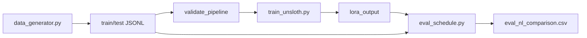

# DFJSP-NL-LoRA

> **自然语言进、自然语言出的动态柔性作业车间调度（DFJSP）端到端实验**  
> 在 RTX 3050 4GB 上，用 Qwen2.5-1.5B + LoRA 验证小模型能否学会「读题干 → 写完整最优排程」。  
> **结论：本设定下未成功（negative result）**；仓库保留完整流水线、数据与可复现脚本，供研究与避坑参考。

[English summary](#english-summary) · [完整实验报告](REPORT.md) · [结果 CSV](eval_nl_comparison.csv)

---

## 目录

- [行业发展背景](#行业发展背景)
- [实验背景与动机](#实验背景与动机)
- [实验目的](#实验目的)
- [主要结果（一览）](#主要结果一览)
- [仓库结构](#仓库结构)
- [快速开始](#快速开始)
- [实验流水线](#实验流水线)
- [常见错误与警示](#常见错误与警示)
- [未来展望与预测](#未来展望与预测)
- [引用与许可](#引用与许可)

---

## 行业发展背景

### 智能制造与调度

**作业车间调度（Job Shop Scheduling, JSP）** 与 **柔性作业车间（FJSP）** 是离散制造的核心 NP-hard 问题：在机器互斥、工序先后顺序约束下，决定「哪道工序、上哪台机、何时开工」，以最小化完工时间（makespan）、拖期或能耗。

传统路径依赖：

| 路线 | 代表方法 | 特点 |
|------|----------|------|
| 精确优化 | MIP、CP-SAT（如 OR-Tools） | 质量高，规模一大则超时 |
| 启发式 / 元启发式 | GA、PSO、禁忌搜索 | 工程常用，需领域调参 |
| 强化学习 | GNN + PPO、端到端策略 | 泛化与可解释性仍在探索 |
| 大模型 | LLM 作规划器、Copilot、Tool-use | 2023–2026 快速升温 |

### 大模型 + 运筹的交汇

工业界与学术界正在尝试：

1. **自然语言交互**：计划员用口语描述「急单插队、某机台故障」，系统返回调整方案。  
2. **LLM 作启发式**：生成初始解或邻域操作，再由求解器精炼。  
3. **端到端生成**：直接输出排程文本或结构化计划（本仓库属于此类中最「纯粹」的一种——**输入输出均为自然语言完整排程**）。

与此同时，业界对「**小模型 + 边缘 GPU**」的关注上升：在 4–8 GB 显存的笔记本上能否跑通 **微调 + 推理**，直接关系到车间现场部署成本。

### 本仓库在行业图谱中的位置

本实验 **不是** 生产级 APS/MES 产品，而是一次 **可复现的负结果研究**：

- 证明：在 **1.5B + 4GB + 200 条全排程 NL 标签** 下，**LoRA 无法学到可用调度**。  
- 提供：数据生成、NL 格式、训练、评估、过拟合门控的 **完整开源基线**。  
- 警示：仅看 **解析率 100%** 或 **训练 loss→0** 会严重误导；必须以 **工序召回 / makespan** 等硬指标验收。

---

## 实验背景与动机

### 问题场景：动态 FJSP + 急单插队

模拟真实车间常见事件：

- 4 台机器，6 个初始作业，工序可在多机加工（时间不同）。  
- 计划执行到约 **50%** 时插入 **1–2 个急单**。  
- 题干给出 **当前时刻 t**、各机状态、已完成/进行中工序。  
- 要求 **重调度全部工序**，最小化 makespan。

标签由 **Google OR-Tools CP-SAT** 求解（限时 3s/实例），转为自然语言排程列表。

### 为何选「全自然语言 I/O」

许多工作选择 JSON / 表格 / 逐步 dispatch，便于约束解码与后处理。本实验刻意选择 **更难、也更贴近「对话式计划员」** 的设定：

```
题干（中文 NL）  →  模型  →  完整排程（中文 NL，含每台机每道工序的开始时刻）
```

若此路径在极小资源下可行，则对「边缘部署 + 人机协同」有意义；若不可行，负结果同样有价值。

### 硬件约束

| 项 | 配置 |
|----|------|
| GPU | NVIDIA RTX 3050 Laptop **4 GB** |
| 系统 | Windows |
| 训练 | Unsloth 4-bit QLoRA，峰值 VRAM ~1.74 GB |
| 模型 | Qwen2.5-1.5B-Instruct |

---

## 实验目的

### 核心假设（待证伪）

> 在 4 GB 显存下，通过对约 200 条 **全排程自然语言标签** 的 LoRA 微调，  
> Qwen2.5-1.5B 的自由生成排程在 **严格工序匹配** 与 **makespan** 上 **显著优于** 未微调 base。

### 成功标准（未达成）

| 指标 | 含义 |
|------|------|
| strict op recall | 预测工序与标签在 (J,O,M,start,duration) 五元组上完全一致的比例 |
| makespan exact | 预测总完工时间与标签一致的比例 |
| vs base | LoRA 上述指标 **明显高于** base（非仅解析成功） |

### 非目标

- 不做「NL 进、JSON 出」的混合协议（除非另开实验）。  
- 不用 OR-Tools 在线补全时间（避免掩盖模型能力）。  
- 不把「能跑通 pipeline」等同于「学会调度」。

---

## 主要结果（一览）

测试集 **50** 条，详见 [`eval_nl_comparison.csv`](eval_nl_comparison.csv) 与 [`REPORT.md`](REPORT.md)。

| 指标 | Base | LoRA | Oracle |
|------|------|------|--------|
| 解析成功率 | 100% | 100% | 100% |
| 完整方案率 | 98% | **36%** | — |
| 严格工序召回（均值） | 0.56% | **0.20%** | 100% |
| makespan 完全匹配 | 0% | 0% | 100% |
| makespan 平均绝对偏差 | 20.7 | 23.2 | 0 |

**训练**：500 steps，约 1h56m，train_loss ≈ 0.055，step loss → 0；**生成仍抄题干中的 t，未学到最优排程。**

典型失败：题干 `t=18` → 模型输出「J1-O1 … **18时开始**」；makespan 常写成 3、4 等荒谬小数。

---

## 仓库结构

```
scheduling_research/
├── README.md                 # 本文件
├── REPORT.md                 # 完整实验报告（方法、数据、负结果分析）
├── LICENSE                   # MIT
├── data_generator.py         # OR-Tools 生成 train/test JSONL
├── scheduling_format.py      # Prompt、NL 标签、解析、指标
├── train_unsloth.py          # Unsloth LoRA 训练（4GB 优化）
├── train_hf_qlora.py         # HF QLoRA 备选（4GB 上过慢）
├── eval_schedule.py          # base / LoRA / compare / oracle 评估
├── local_inference.py        # HF 4-bit 推理（Windows 兼容）
├── overfit_sanity.py         # 单样本过拟合门控
├── validate_pipeline.py      # 训练前数据与格式校验
├── run_nl_pipeline.ps1       # 三步流水线（推荐）
├── install.ps1               # Windows 依赖安装
├── train_data.jsonl          # 200 训练样本
├── test_data.jsonl           # 50 测试样本
└── eval_nl_comparison.csv    # 公布结果汇总
```

训练产物 `lora_output/` 默认 **不入库**（约 1.5GB）；本地训练后生成。

---

## 快速开始

### 环境（Windows + CUDA 11.8）

```powershell
cd scheduling_research
python -m venv .venv
.\.venv\Scripts\Activate.ps1
.\install.ps1
```

国内镜像（可选）：

```powershell
$env:HF_ENDPOINT = "https://hf-mirror.com"
$env:PYTHONUTF8 = "1"
```

### 生成数据（若需重新生成）

```powershell
.\.venv\Scripts\python.exe data_generator.py
```

### 三步实验

```powershell
.\run_nl_pipeline.ps1 -Step 1    # base 评估
.\run_nl_pipeline.ps1 -Step 2    # LoRA 训练（约 2 小时 / 500 step）
.\run_nl_pipeline.ps1 -Step 3    # base vs LoRA 对比
```

或门控通过后训练：

```powershell
.\run_gate_then_train.ps1
```

### 仅评估已有 adapter

```powershell
.\.venv\Scripts\python.exe eval_schedule.py --mode compare --max-samples 0
```

---

## 实验流水线



1. **Step 1**：Base 模型零样本生成，建立下界。  
2. **Step 2**：SFT + LoRA，仅对 assistant 排程段算 loss；保存 adapter 与 `merged_hf`。  
3. **Step 3**：同一测试集对比；输出 CSV 与样例。

---

## 常见错误与警示

> 本仓库最重要的「开源价值」之一：列出我们踩过的坑，避免他人重复浪费算力。

### 1. 题干与标签的语义冲突（本实验主因）

| 题干强调 | 标签要求 |
|----------|----------|
| 当前时刻 **t=18**，机器实时状态 | **全局从 0 起** 的完整最优排程 |
| 叙事面向「此刻如何排」 | 许多工序 `start < t` |

模型最省力策略：**把 t 抄进每条工序的开始时刻**。系统提示写「不要用 t」不足以扭转。  
**警示**：设计 NL 任务时，**输入叙事与输出坐标系必须一致**。

### 2. loss→0 ≠ 学会任务

单样本过拟合 400 step 后 loss ≈ 0，但 **strict op recall 仍为 0%**（jom ~29%）。  
全量 500 step 同样现象。  
**警示**：必须用 **自由生成 + 任务指标** 验收；teacher forcing 损失会骗人。

### 3. 解析率 100% 的幻觉

Base / LoRA 均能输出「像排程」的中文列表 → 解析器通过。  
但工序内容与标签 **几乎全错**。  
**警示**：领域任务要定义 **结构化正确性指标**，不能只看格式合法。

### 4. Windows + Unsloth 推理

Unsloth 的 `generate` 在 Windows 上不可靠；本仓库 **评估统一走 HF `model.generate`**（`local_inference.py`）。  
LoRA 加载须用 **`unsloth/Qwen2.5-1.5B-Instruct`** 作 base，与 `Qwen/` 命名空间区分。

### 5. 4GB 显存与进程

- 训练峰值 ~1.74 GB 正常；**同时开两个 Python 占 GPU 会挂死**。  
- `UNSLOTH_COMPILE_DISABLE=1`：Windows + Triton 3.7 下避免 compile 崩 backward。  
- HF 原生 QLoRA 训练约 **15× 慢于 Unsloth**，全量 500 step 不现实。

### 6. 跳过过拟合门控

`overfit_sanity.py` 在 1 条样本上即可预判全量训练无效。  
本实验跳过门控仍训满 500 step，**结果与门控一致**。  
**警示**：小数据 + 长结构化输出，**务必先过拟合 1 条**。

### 7. 合并 4bit 权重

`save_pretrained_merged(..., merged_4bit_forced)` 可能有舍入误差；评估以 **adapter + 同 base** 为准更稳。

---

## 未来展望与预测

### 短期（6–12 个月）

| 方向 | 预测 |
|------|------|
| **LLM + 求解器工具调用** | 工业落地仍以「模型理解意图 + CP-SAT/MIP 算方案」为主流；纯 NL 全排程不会成为主流接口。 |
| **小模型边缘微调** | 4–8 GB 可训 **短输出、强约束** 任务（分类、单步 dispatch）；**30+ 行自由生成** 仍超出 1.5B 能力圈。 |
| **负结果论文/报告** | 「何种 NL 调度公式在何种规模下不可行」会成为有价值基线，避免重复造轮子。 |

### 中期（1–3 年）

- **7B+ 量化 + 更长上下文** 在单卡 8–12 GB 上可能改善 **机器指派（J-O-M）** 子任务，但 makespan 全局最优仍难保证。  
- **约束解码 / grammar-guided generation** 会替代纯自由文本排程。  
- **数字孪生 + 实时重调度** 更依赖传统优化与 RL，LLM 负责解释、对比方案、异常问答。

### 若坚持「NL 全排程」研究方向

在 **不改变输出形态** 的前提下，可能有效的改动（本仓库未做，供后续工作参考）：

1. **扩大数据** 至 10³–10⁴ 实例，课程学习（先短排程后长排程）。  
2. **题干/标签同一时空参照**（例如标签也写相对 t，或题干不突出与标签矛盾的 t）——但这会 **改变任务定义**，需新开实验说明。  
3. **更大模型 + DPO**：以「抄 t」为负样本偏好优化。  
4. **检索增强**：相似实例排程进 context（few-shot），而非纯参数记忆。

### 本仓库维护预期

- 保持 **可复现负结果** 与脚本可运行性。  
- **不** 承诺发布预训练权重（体积大、效果未达标）。  
- 欢迎 Issue / PR：修复 Windows 兼容性、补充 ablation、英文文档等。

---

## 引用与许可

若本仓库对你的研究或工程有帮助，可引用：

```bibtex
@misc{dfjsp_nl_lora_2026,
  title        = {DFJSP-NL-LoRA: Natural Language End-to-End Scheduling with LoRA on 4GB GPU (Negative Result)},
  year         = {2026},
  howpublished = {\url{https://github.com/YOUR_USERNAME/dfjsp-nl-lora}},
  note         = {Open-source reproducibility baseline for DFJSP natural language I/O}
}
```

请将 `YOUR_USERNAME` 替换为实际 GitHub 用户名。

**License:** [MIT](LICENSE)

---

## English Summary

**DFJSP-NL-LoRA** tests whether **Qwen2.5-1.5B-Instruct** with **4-bit LoRA** on a **4GB RTX 3050** can learn **natural-language in → full natural-language schedule out** for **dynamic flexible job-shop scheduling** with rush orders.

- **Data:** 200 train / 50 test instances; labels from **OR-Tools CP-SAT**.  
- **Result:** Training loss converges, but **free-generation op recall ≈ 0%**; LoRA does **not** beat the base model. Models mostly **copy the prompt time `t`** instead of global optimal start times.  
- **Value:** Full pipeline, pitfalls documented, and a **negative result** for the community. See [REPORT.md](REPORT.md) for details.

---

## 致谢

- [Qwen](https://github.com/QwenLM/Qwen) / [Unsloth](https://github.com/unslothai/unsloth) / [OR-Tools](https://developers.google.com/optimization) / [Hugging Face](https://huggingface.co)
